DEVAIM

DEVAIM is a lightweight developer assistant and dashboard tool inspired by platforms like GitLab and Jenkins. Built using React, HTML, and CSS, it integrates with the GitHub API to provide an interactive interface for monitoring and managing key GitHub repository data such as Issues, Pull Requests, and more.

## 🔍 Features

- 🔗 GitHub API Integration: Connect to your GitHub repositories and fetch real-time data.
- 🐛 Issue Tracker: View and filter issues from any GitHub repository.
- 📦 Pull Request Viewer: Track open, closed, and merged pull requests.
- 📊 Project Dashboard: A clean and responsive UI to display repository data.
- ⚙️ Modular & Extendable: Easily adaptable for other APIs or Git platforms in the future.

## 🚀 Technologies Used

- React – Front-end library for building user interfaces.
- HTML5 & CSS3 – Structuring and styling the application.
- GitHub REST API – For fetching data like issues and pull requests.
- GitHub REST API

## 📸 Screenshots

### 🔐 Login Page

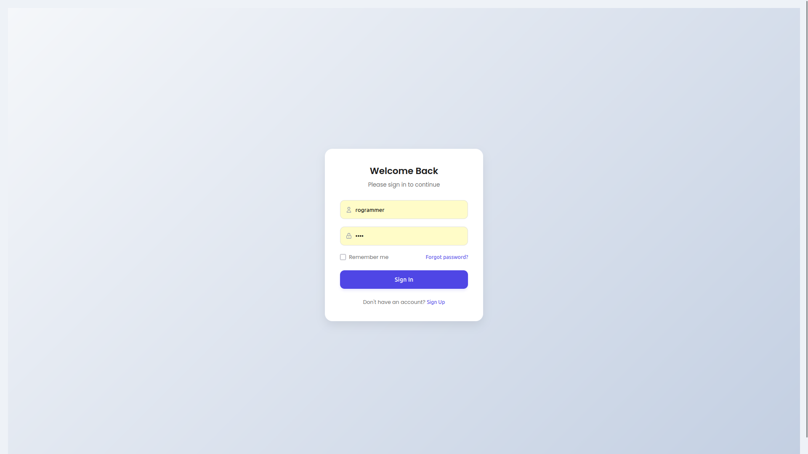

### 🔑 Register Page

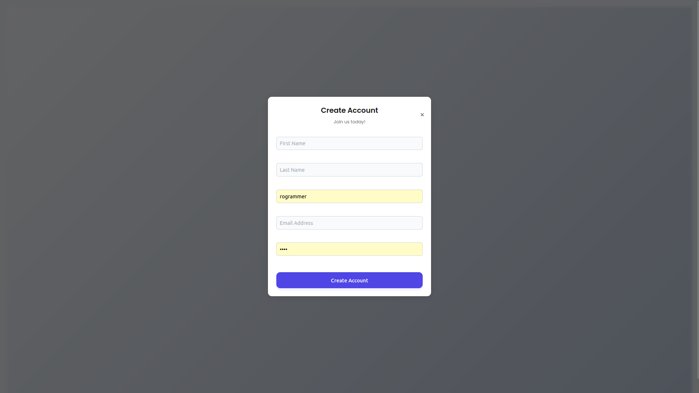

### 📝 Forgot Password Page

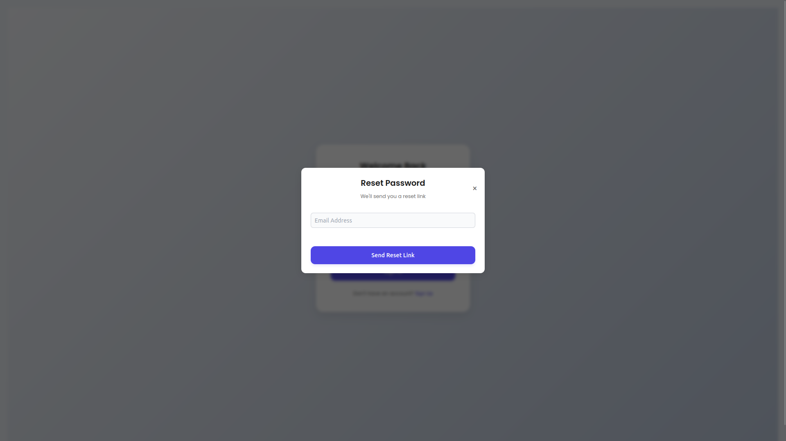

### 🏠 Home Page

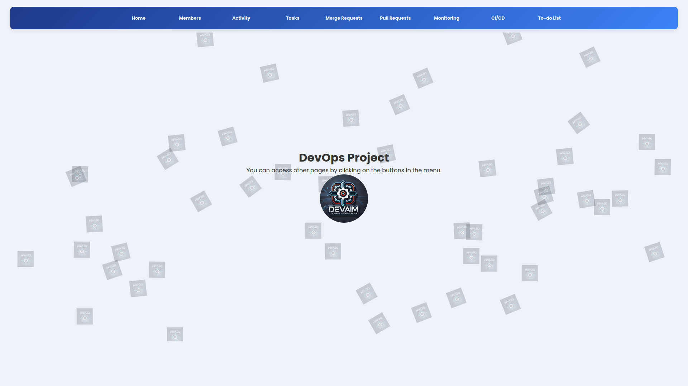

### 👥 Members Page

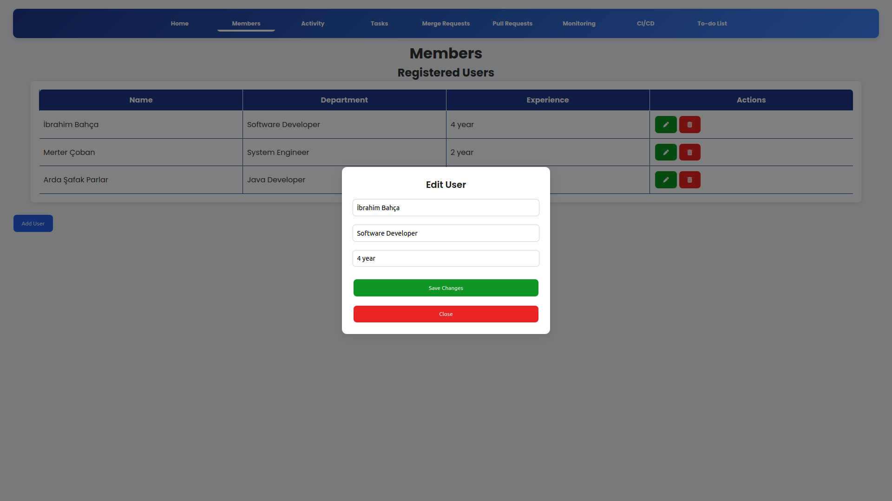

### 📅 Activity Page

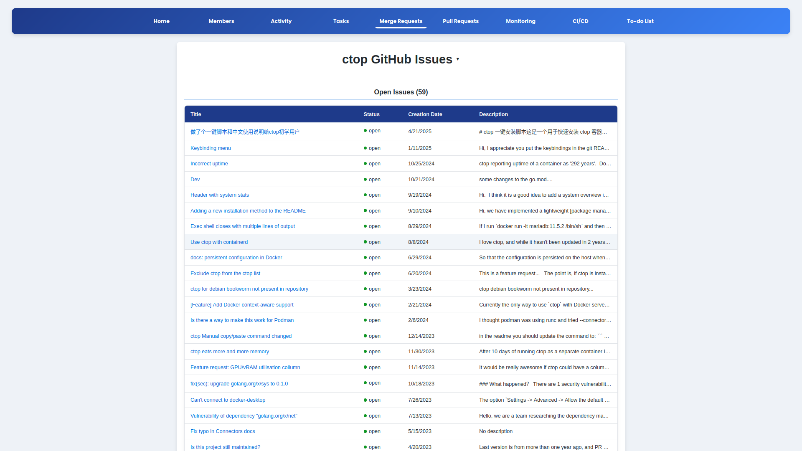

### ✅ Tasks Page

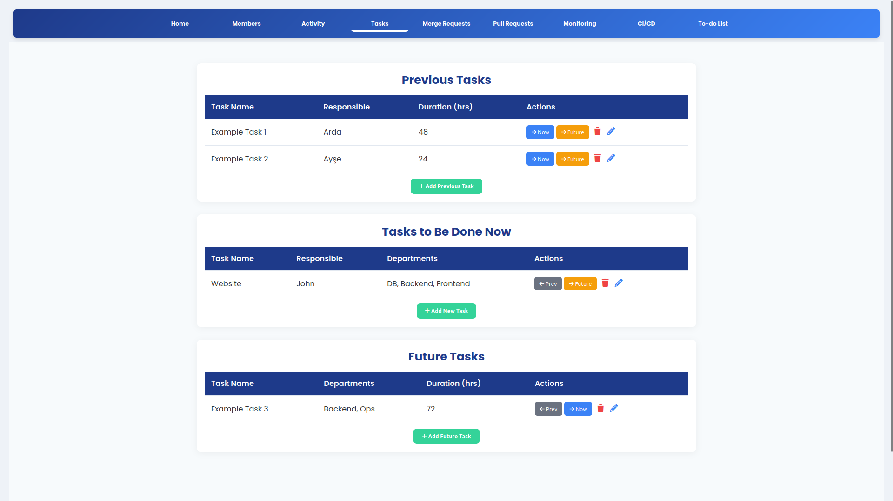

### 🔀 Merge Requests Page

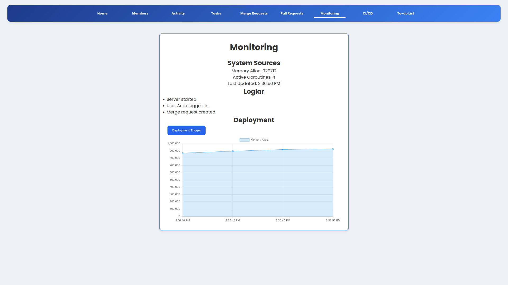

### 🔃 Pull Requests Page

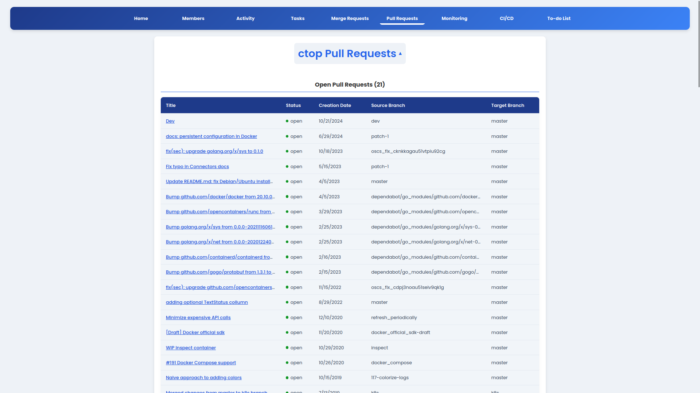

### 📊 Monitoring Page

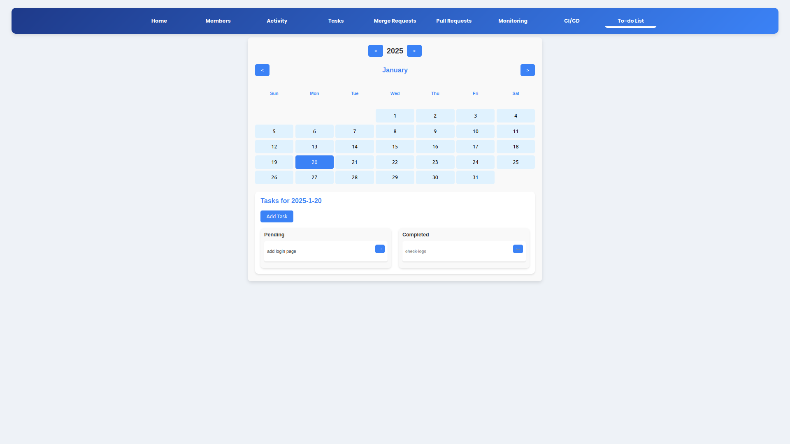

### ⚙️ CI/CD Page

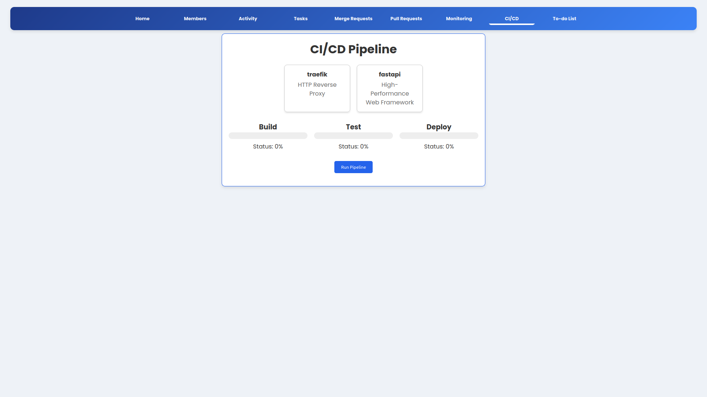

### 📝 To-do List Page

## 📌 Future Plans

- GitLab integration
- CI/CD visualization (like Jenkins pipelines)
- Authentication with OAuth
- Team dashboards and analytics

🤝 Contributing

Contributions are welcome! Please open an issue or pull request for suggestions, bug fixes, or improvements.

📄 License

This project is open-source and available under the MIT License.
